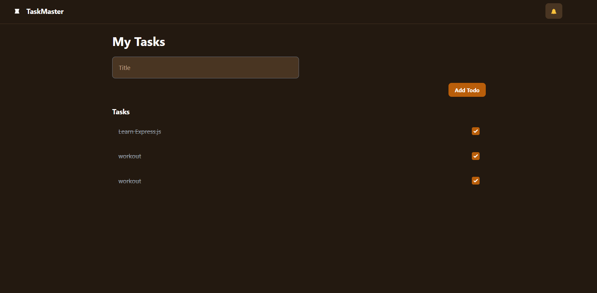

# 📝 TaskMaster - ToDo App

A full-stack ToDo application built using the **MERN stack (MongoDB, Express.js, React, Node.js)**.  
This project allows users to create, view, update, and manage tasks through a simple and elegant interface.

---

## 📌 Features

- ✅ Add new tasks with a title
- ✅ View all tasks in a clean UI
- ✅ Mark tasks as complete/incomplete
- ✅ Fully responsive and styled using Tailwind CSS
- ✅ Backend built with Express.js & MongoDB (Mongoose)
- ✅ REST API tested via Postman and integrated with Axios

---

## 🚀 Tech Stack

| Technology   | Purpose                          |
|--------------|----------------------------------|
| React.js     | Frontend (UI Layer)              |
| Tailwind CSS | UI Styling                       |
| Axios        | HTTP Client (frontend ↔ backend) |
| Node.js      | Backend runtime                  |
| Express.js   | Web server/API handling          |
| MongoDB      | NoSQL Database                   |
| Mongoose     | MongoDB ODM                      |

---

## 📂 Folder Structure

```

TODO\_app/
├── backend/
│   ├── controllers/
│   ├── models/
│   ├── routes/
│   ├── .env
│   └── server.js
├── taskmaster-frontend/
│   ├── src/
│   │   ├── components/
│   │   ├── App.js
│   │   └── index.css

````

---

## 🛠️ How to Run Locally

### 📁 1. Clone the Repository
```bash
git clone https://github.com/yourusername/taskmaster-todo.git
cd TODO_app
````

---

### 🔧 2. Setup Backend

```bash
cd backend
npm install
```

> Make sure MongoDB is installed and running locally.

**Create a `.env` file inside `/backend`:**

```env
PORT=
MONGO_URI=MONGO_URI
```

**Run the server:**

```bash
npm start
```

---

### 💻 3. Setup Frontend

```bash
cd ../taskmaster-frontend
npm install
```

**Start React App:**

```bash
npm start
```


---

## 📷 Screenshots
